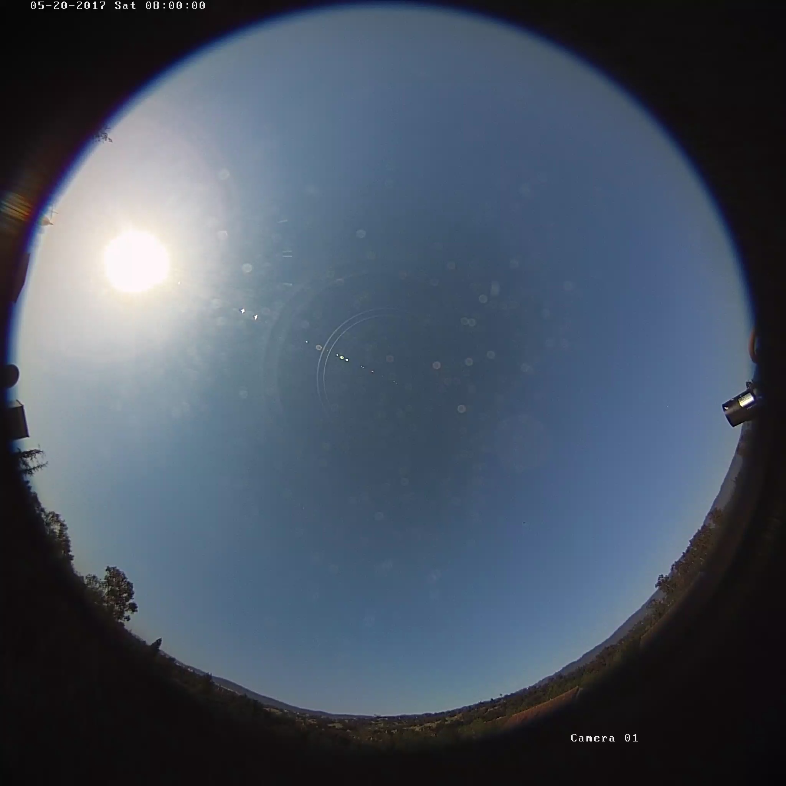

# Cloud detection in sky images

Clouds significantly impact PV panel output and pose challenges to the large-scale deployment of solar PV systems. Accurate detection of clouds in sky images is a critical step in cloud modeling, which is essential for reliable solar power forecasting. 

Figure 1. Power output of a 30-kW roof-top PV system on a partly cloudy day. Note how PV output fluctuates during the cloud events.

This repository presents an easy-to-implement yet effective algorithm for detecting clouds in ground-based sky images. This algorithm has been used in the study by [Nie et al. (2020)](https://pubs-aip-org.stanford.idm.oclc.org/aip/jrse/article/12/4/046101/284973) to identify cloud pixels in sky images for sky condition classification, which enables the development of tailored models for solar nowcasting specific to each sky condition. This classification-prediction framework show better performance with less model trainable parameters than the deep learning model [SUNSET](https://pubs-rsc-org.stanford.idm.oclc.org/en/content/articlehtml/2018/ee/c7ee03420b) that learns a map from sky images to PV power generation in an end-to-end fashion.

<!---  just --->